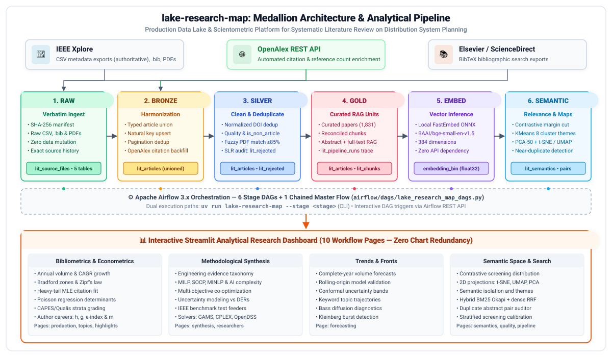

# lake-research-map

[](https://www.python.org/downloads/)
[](tests/)
[](https://github.com/astral-sh/uv)
[](src/lake_research_map/dashboard/)
[](airflow/)
[](src/lake_research_map/db/)
[](https://github.com/astral-sh/ruff)
[](LICENSE)


`lake-research-map` is a production-grade **Medallion Data Lake**, automated ETL pipeline, and scientometric research platform engineered for a Systematic Literature Review (SLR) on:
> **"Distribution System Planning" (Electric Power Distribution Networks)**

It transforms raw, heterogeneous, and partial bibliographic search exports from **IEEE Xplore** and **Elsevier ScienceDirect** into a structured, versioned, audit-ready, RAG-enabled corpus. The active 2026-09-21 audit contains 3,115 Gold articles and 7,552 text chunks. Without writing direct SQL queries, researchers explore scientometric, econometric, network, and semantic evidence through an interactive 10-page Streamlit analytical dashboard orchestrated by Apache Airflow.

---

## 📑 Table of Contents

- [The Systematic Literature Review (SLR) Challenge](#-the-systematic-literature-review-slr-challenge)
- [Medallion Data Lake Architecture](#-medallion-data-lake-architecture)
  - [Pipeline Stages](#pipeline-stages)
  - [Multi-Project Database Isolation](#multi-project-database-isolation)
  - [Binary Vector Embeddings (`LargeBinary` float32)](#binary-vector-embeddings-largebinary-float32)
- [Interactive Analytical Dashboard (10 Pages)](#-interactive-analytical-dashboard-10-pages)
- [Scientometric, Econometric & Machine Learning Rigor](#-scientometric-econometric--machine-learning-rigor)
- [Quickstart & Deployment](#-quickstart--deployment)
  - [Prerequisites & Setup](#prerequisites--setup)
  - [Pipeline CLI Execution](#pipeline-cli-execution)
  - [Streamlit Dashboard](#streamlit-dashboard)
  - [Airflow & Multi-Container Deployment](#airflow--multi-container-deployment)
- [Testing & Quality Assurance](#-testing--quality-assurance)
- [Project Directory Structure](#-project-directory-structure)
- [Documentation & Architectural Standards](#-documentation--architectural-standards)

---

## ⚡ The Systematic Literature Review (SLR) Challenge

Modern electric power distribution networks are undergoing unprecedented architectural shifts driven by the integration of Distributed Energy Resources (DERs, rooftop solar PV, wind generation), Battery Energy Storage Systems (BESS), Electric Vehicle (EV) fast-charging hubs, microgrids, and extreme weather climate resilience mandates. Synthesizing decades of mathematical optimization and planning methodologies requires navigating thousands of academic papers.

Doing this manually from raw publisher exports presents severe methodological roadblocks:

1. **Heterogeneous Publisher Formats**: IEEE Xplore exports metadata CSVs alongside paginated `.bib` files and bulk PDF packages. Elsevier ScienceDirect exports paginated `.bib` files only. IEEE BibTeX exports concatenate entries without newlines or separators (`month={Feb},}@ARTICLE{...`), breaking standard parsers.
2. **DOI Discrepancies**: Elsevier provides full URL DOIs (`https://doi.org/10.1016/...`), while IEEE provides bare DOI strings (`10.1109/...`). Without strict canonical normalization (stripping URL prefixes, trimming whitespace, and casefolding), deduplication fails.
3. **Lexical Ambiguity (The Logistics Distraction)**: The keyword query `"distribution system planning"` is polysemous. In addition to electric power distribution networks, it matches supply-chain management, warehouse locations, and freight logistics literature (~9% of raw search results). Crude keyword exclusions risk dropping valid interdisciplinary papers; `lake-research-map` solves this via **contrastive semantic screening**.
4. **Corpus Partiality & Auditability**: Counts are tied to the active immutable dataset version rather than hard-coded documentation. The pipeline captures partiality explicitly, logging every dropped row to `silver.lit_rejected` to maintain PRISMA-compatible SLR audit trails.

---

## 🏗️ Medallion Data Lake Architecture

The pipeline implements a 6-tier Medallion architecture orchestrated by Apache Airflow and managed through SQLAlchemy 2.0 declarative models:



### Pipeline Stages

| Stage | Target Database / Table | Core Responsibilities |
|---|---|---|
| **1. Raw** | `raw.lit_*` | Content-addressed retention of consumed IEEE/Elsevier exports, search configuration, enrichment cache, and PDFs. The default append policy combines new files with archived active sources; `--source-policy snapshot` explicitly mirrors only the files currently on disk. |
| **2. Bronze** | `bronze.lit_articles` | Transactional cross-source schema harmonization with file-qualified natural keys and dataset lineage. Records are classified as `journal`, `conference`, `review`, or `other`, and citation/reference backfills are applied from `data/enrichment_cache.json`. |
| **3. Silver** | `silver.lit_articles`<br>`silver.lit_rejected` | Deduplicates records by normalized DOI into single authoritative paper records while preserving publication category and classification basis. Tags non-article items, executes fuzzy PDF matching via `rapidfuzz` ($\ge 85$), and audits DOI-less rows in `silver.lit_rejected`. |
| **4. Gold** | `gold.lit_articles`<br>`gold.lit_chunks`<br>`gold.lit_dataset_*`<br>`gold.lit_pipeline_*` | Builds an isolated, immutable candidate snapshot, applies reviewed duplicate decisions, reuses compatible unchanged vectors, and records parent/stage lineage. The live Gold projection is replaced only after publication gates pass. |
| **5. Embed** | `gold.lit_dataset_chunks.embedding_bin` | In-process vectorization using local ONNX-accelerated `fastembed` (`BAAI/bge-small-en-v1.5`, 384 dimensions). Completeness, model, binary dimension, and finite-value contracts block incompatible candidates. |
| **6. Semantic** | `gold.lit_dataset_semantics`<br>`gold.lit_dataset_duplicate_pairs` | Contrastive semantic screening, theme discovery, projections, and duplicate candidates at 100% eligible abstract coverage. Successful completion atomically publishes all candidate Gold outputs. |

### Multi-Project Database Isolation

The underlying MySQL server hosts multiple discrete databases named plainly after the medallion tiers: `raw`, `bronze`, `silver`, and `gold`. These databases are shared with unrelated projects (e.g., `fastf1_results`, `personal_expenses`).

> [!IMPORTANT]
> To preserve multi-tenant isolation, `lake-research-map` strictly queries and modifies tables bearing the `lit_` prefix. Non-`lit_` tables are completely ignored by migrations, queries, and automated tests.

### Binary Vector Embeddings (`LargeBinary` float32)

Vector embeddings for RAG retrieval and manifold projections are stored directly as native IEEE 754 float32 byte arrays (`LargeBinary` in MySQL):
- **82% Storage Footprint Reduction**: Binary serialization drops per-vector storage from ~8.5 KB (JSON array of floats) to **1,536 bytes** (`384 * 4 bytes`), reducing chunk table size from ~50 MB to ~9 MB.
- **Zero-Copy In-Memory Vectorization**: Deserialization executes instantaneously via `np.frombuffer(raw_bytes, dtype=np.float32)`, eliminating JSON parsing bottlenecks and accelerating in-memory k-NN vector search by 5–10x.

---

## 📊 Interactive Analytical Dashboard (10 Pages)

The Streamlit dashboard (`src/lake_research_map/dashboard/`) is partitioned into **10 workflow-oriented pages**. A fixed dark theme, responsive containers (`width="stretch"`), English interface text, and global publication-category filtering keep the interface consistent.

| Page | Analytical Scope & Dedicated Tabs |
|---|---|
| **Overview** | High-level article counts plus publisher and publication-category distributions. |
| **Production & Journals** | Annual output by category, cumulative growth, venue concentration, and CAPES/Qualis coverage. |
| **Topics & Scientific Structure** | Vocabulary, co-occurrence, semantic themes, Bradford/Zipf diagnostics, and descriptive keyword-combination novelty. |
| **Impact & Citations** | Reference and citation distributions, age-normalized impact, heavy-tail diagnostics, and an exposure-adjusted count GLM with robust intervals. |
| **Researchers & Collaboration** | Corpus-scoped author productivity and impact, temporal trajectories, co-authorship networks, research lines, and bibliometric laws. |
| **Engineering Evidence** | Optimization paradigms, objectives, uncertainty, planning horizons, test feeders, and solver evidence. |
| **Trends & Fronts** | Complete-year volume forecasts with rolling validation and conformal bands, topic trajectories, Bass diagnostics, and two-state Kleinberg bursts. |
| **Screening & Discovery** | Contrastive relevance margins, semantic projections and themes, isolation scores, and persistent near-duplicate review history. |
| **Data Quality & RAG** | Metadata coverage, full-text and embedding readiness, anomaly audit, and hybrid retrieval diagnostics. |
| **Pipeline & Provenance** | Medallion funnel, schema drift, run history, rejected-record audit, Airflow triggers, and source-search provenance. |

---

## 🔬 Scientometric, Econometric & Machine Learning Rigor

All analytical functions reside in `dashboard/analytics.py` and `dashboard/forecasting.py` as **pure, stateless mathematical functions** independent of Streamlit and MySQL:

```
                                  ANALYTICAL RIGOR
 ┌───────────────────────────────────────┬──────────────────────────────────────────┐
 │ Scientometrics & Bibliometrics        │ Formulations & Algorithmic Foundations   │
 ├───────────────────────────────────────┼──────────────────────────────────────────┤
 │ Contrastive Relevance Screening       │ Δ = cos(e_i, a_topic) - cos(e_i, a_log)  │
 │ Bass Innovation Diffusion             │ f(t) = (p+q)^2 / p * e^-(p+q)t / (1+q/p) │
 │ Conformal Forecast Intervals          │ ŷ_{t+h} ± Q₀.₉(|rolling error|) * √h     │
 │ Hybrid Retrieval (RRF)                │ RRF(d) = Σ 1 / (60 + rank_m(d))          │
 │ Exposure-adjusted Count GLM           │ log E[y] = Xβ + log(article age + 1)     │
 │ Two-state Kleinberg Burst             │ min emission cost + upward state penalty │
 │ Small-World Network Topology          │ σ = (C / C_rand) / (L / L_rand)          │
 │ Zhang's Excess Impact Index           │ e^2 = Σ_{i=1}^h c_i - h^2                │
 └───────────────────────────────────────┴──────────────────────────────────────────┘
```

### Coverage is reported, not assumed

Methods are only half of a claim; the other half is what they ran over. Two
rules are enforced in the codebase rather than left to the reader:

- **Every dashboard page states its dataset version and population** — a
  provenance caption naming the immutable version, its publication time, and
  how many articles survived the active filters.
- **Externally collected data reports coverage per publisher, against the
  corpus.** OpenAlex enrichment runs under a request quota and is therefore
  often partial; an aggregate percentage over a partial crawl inherits whatever
  ordered that crawl. Collection is publisher-proportional by construction
  (`ADR-07`), and `audit citation-graph` / `audit citation-years` print a
  per-registrant table marking any source the crawl has not reached.

---

## 🚀 Quickstart & Deployment

### Prerequisites & Setup

Requires [uv](https://docs.astral.sh/uv/) (Python 3.13) and an accessible MySQL instance:

```bash
# 1. Clone repository
git clone https://github.com/rvanguita/lake-research-map.git
cd lake-research-map

# 2. Sync virtual environment and lockfile
uv sync

# 3. Configure environment
cp .env.example .env
# Configure MYSQL_HOST, MYSQL_PORT, MYSQL_USER, MYSQL_PASSWORD in .env
```

### Pipeline CLI Execution

Run pipeline stages directly via the `lake-research-map` CLI:

```bash
# Execute full pipeline end-to-end (bootstraps schemas, runs all 6 stages)
uv run lake-research-map --stage all

# Execute discrete stages independently
uv run lake-research-map --stage raw        # Ingest raw publisher exports
uv run lake-research-map --stage bronze     # Schema harmonization + OpenAlex backfill
uv run lake-research-map --stage silver     # DOI deduplication, PDF matching, reject logging
uv run lake-research-map --stage gold       # Curated articles, chunks, telemetry
uv run lake-research-map --stage embed      # Local ONNX binary vector embeddings
uv run lake-research-map --stage semantic   # Contrastive screening, themes, projections

# Review cross-DOI near-duplicate candidates (dashboard remains read-only)
uv run lake-research-map duplicates list --all
uv run lake-research-map duplicates merge --canonical-doi DOI --duplicate-doi DOI --reason "same work"
uv run lake-research-map duplicates keep --doi-a DOI --doi-b DOI --reason "distinct publications"
uv run lake-research-map duplicates undo --doi-a DOI --doi-b DOI
# Any merge/undo changes the curation fingerprint; publish it through a new full run.
uv run lake-research-map --stage all

# Inspect versions or reactivate a previously published Gold snapshot
uv run lake-research-map versions list
uv run lake-research-map versions activate --version-id VERSION_SHA256

# Schema bootstrap & additive column migration
uv run python -m lake_research_map.db.bootstrap
```

### Streamlit Dashboard

Launch the analytical dashboard locally:

```bash
uv run streamlit run main.py
```
Open [http://localhost:8501](http://localhost:8501) in your browser.

### Airflow & Multi-Container Deployment

Run Airflow and the dashboard simultaneously using Docker Compose:

```bash
docker compose up -d
```

- **Streamlit Dashboard**: [http://localhost:8501](http://localhost:8501)
- **Apache Airflow UI**: [http://localhost:8080](http://localhost:8080) (Default login: `admin` / `admin`)

Airflow DAGs (`airflow/dags/lake_research_map_dags.py`) execute stages via `BashOperator` calling `uv run lake-research-map --stage <stage>`. Pipeline logic runs identically whether triggered via CLI, Streamlit UI, or Airflow REST API.

---

## 🧪 Testing & Quality Assurance

The codebase features an exhaustive automated test suite:
- **More than 230 automated tests**, with a **< 5-second reference-environment target** for the default SQLite suite and separate MySQL/API acceptance runs.
- **Zero Live MySQL Dependency**: All tests execute against isolated, in-memory SQLite fixtures (`tests/conftest.py`) replicating the multi-layer medallion schemas.

```bash
# Run full automated test suite
uv run pytest

# Execute static analysis and linting
uv run ruff check

# Verify formatting compliance
uv run ruff format --check
```

### Pre-Commit Security & Branch Protection

Pre-commit hooks are configured to enforce security and architectural standards:
```bash
uv tool install pre-commit
pre-commit install
```
- **Gitleaks**: Scans staged diffs for hardcoded passwords, tokens, and private keys.
- **Block Docs on Main** (`scripts/git-hooks/check-docs-branch.sh`): Prevents direct documentation commits to `main`, requiring dedicated feature or `docs/*` branches.

---

## 📂 Project Directory Structure

```
lake-research-map/
├── src/lake_research_map/
│   ├── config.py                 # Pydantic environment & database configuration
│   ├── pipeline.py               # Medallion CLI controller (run_raw, run_bronze, etc.)
│   ├── db/                       # SQLAlchemy 2.0 multi-database models
│   │   ├── raw_models.py         # lit_source_files, lit_config, lit_bib_entries
│   │   ├── bronze_models.py      # lit_articles union schema
│   │   ├── silver_models.py      # lit_articles deduplicated, lit_rejected audit log
│   │   ├── gold_models.py        # Gold articles, chunks, semantics, runs, duplicate overrides
│   │   ├── engines.py            # Layer database session factories
│   │   └── bootstrap.py          # Table creation and additive column migrations
│   ├── ingest/                   # Raw parsing & API enrichment
│   │   ├── raw_csv.py            # IEEE CSV parser
│   │   ├── raw_bib.py            # Robust BibTeX parser (handles no-separator gotcha)
│   │   ├── raw_pdfs.py           # PDF manifest inventory
│   │   ├── raw_config.py         # Search query provenance parser
│   │   ├── openalex.py           # OpenAlex REST enrichment client
│   │   └── hashing.py            # Sha256 idempotency hashing
│   ├── transform/                # Medallion transformations
│   │   ├── bronze_articles.py    # Schema unification
│   │   ├── silver_articles.py    # Normalized DOI dedup & RapidFuzz PDF matching
│   │   ├── gold_articles.py      # Curated RAG chunks with hash reconciliation
│   │   ├── duplicate_resolution.py # Persistent merge/keep review decisions
│   │   ├── embeddings.py         # Local ONNX fastembed vectorization (LargeBinary float32)
│   │   ├── semantics.py          # Contrastive screening, KMeans, UMAP/t-SNE/PCA
│   │   └── screening_calibration.py # SLR sensitivity/recall threshold calibration
│   └── dashboard/                # Multipage Streamlit application
│       ├── app.py                # Dashboard navigation & router
│       ├── data.py               # Raw SQL data layer
│       ├── loaders.py            # @st.cache_data caching and normalization
│       ├── analytics.py          # Pure mathematical, scientometric & network analytics
│       ├── forecasting.py        # Regression benchmarking, quantiles, Bass diffusion
│       ├── search.py             # Hybrid BM25 Okapi + Dense Vector Faiss/RRF search
│       ├── theme.py              # Fixed-dark theme tokens and transparent polar styling
│       ├── components.py         # Reusable Streamlit UI widgets & metric cards
│       ├── airflow_client.py     # Airflow REST API client
│       └── pages/                # 10 workflow-oriented analytical controllers
├── airflow/                      # Airflow DAGs mirroring CLI pipeline stages
│   └── dags/lake_research_map_dags.py
├── docs/                         # Architecture, product specs, and assets
│   ├── PRD.md                    # Product Requirements Document
│   ├── SDD.md                    # System Design Document
│   ├── ROADMAP.md                # Strategic research & feature backlog
│   └── images/
│       ├── lake_research_map_hero.png # High-resolution hero illustration (white background)
│       ├── lake_research_map_hero.svg # Vector source for hero illustration
│       ├── architecture.svg      # Legacy pipeline architecture diagram
│       └── medallion_architecture.svg # Modern white-background medallion architecture diagram
├── scripts/
│   ├── generate_hero.py          # Programmatic vector renderer for hero assets
│   └── git-hooks/                # Pre-commit hook shell scripts
├── tests/                        # 406 unit/integration tests (SQLite in-memory)
├── AGENTS.md                     # Universal guidelines for AI assistants
├── CLAUDE.md                     # Source-data quirks and environment notes
├── docker-compose.yml            # Airflow + Dashboard container orchestration
└── pyproject.toml                # Project metadata, dependencies, and Ruff config
```

---

## 📖 Documentation & Architectural Standards

For in-depth documentation and contributor guidelines:
- **System Design Document**: [`docs/SDD.md`](docs/SDD.md) — Exhaustive technical architecture, schema specifications, and algorithmic formulas.
- **Product Requirements Document**: [`docs/PRD.md`](docs/PRD.md) — Motivation, 15 user personas, functional specifications, and acceptance criteria.
- **Strategic Roadmap**: [`docs/ROADMAP.md`](docs/ROADMAP.md) — Active research directions, validation metrics, and improvement backlog.
- **AI Assistant Guidelines**: [`AGENTS.md`](AGENTS.md) — Universal rules, testing standards, and Streamlit conventions for AI pairs.
- **Corpus Parsing Gotchas**: [`CLAUDE.md`](CLAUDE.md) — Raw publisher data quirks, BibTeX separators, and DOI matching nuances.

---

## ⚖️ License

This project is licensed under the MIT License — see the [LICENSE](LICENSE) file for details.
